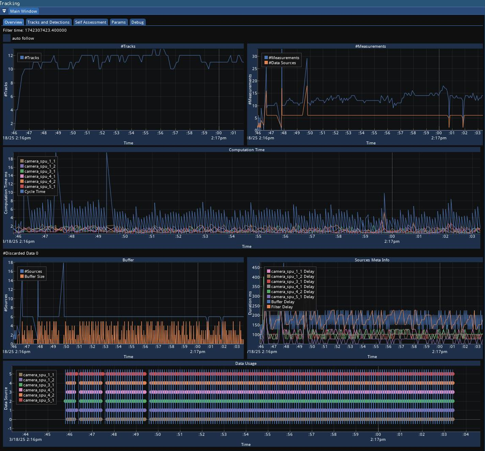
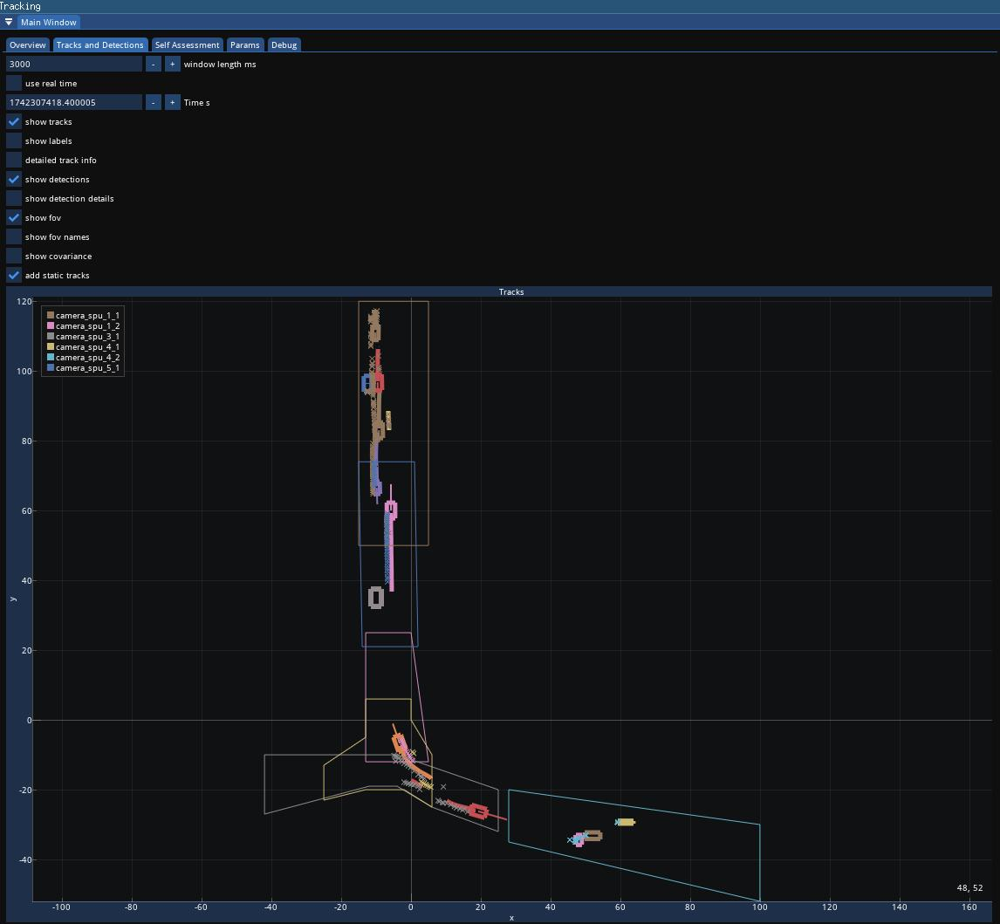
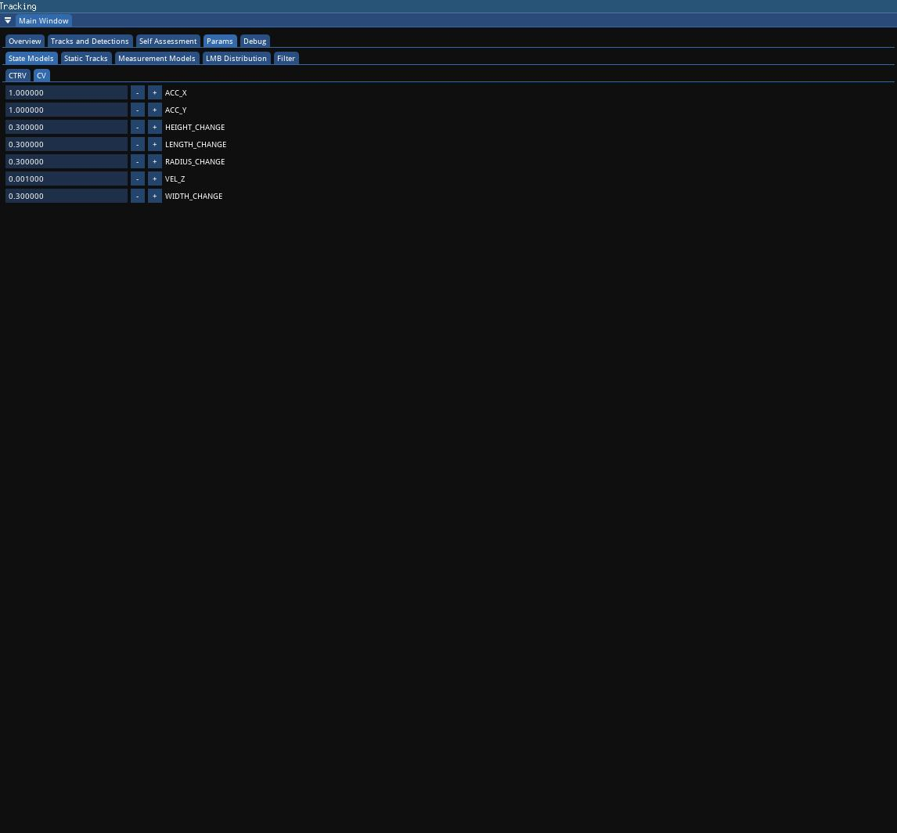
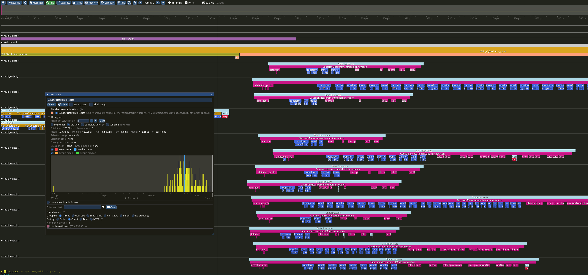

# ADUULM-TTB: A Scalable, Generic, and Efficient Multi-Sensor Multi-Object Tracking Toolbox

This repository will contain the code for ADUULM-TTB (Autonomous Driving at Ulm University - Tracking ToolBox), as
described in our paper submitted to the FUSION 2025 conference.

If you use this toolbox, please cite [Fusion paper if accepted].

The following publications are based on this toolbox:

* [Track Classification for Random Finite Set Based Multi-Sensor Multi-Object Tracking](https://doi.org/10.1109/SDF-MFI59545.2023.10361438)
* [Self-Monitored Clutter Rate Estimation for the Labeled Multi-Bernoulli Filter](https://doi.org/10.23919/FUSION59988.2024.10706463)
* [An Efficient Implementation of the Fast Product Multi-Sensor Labeled Multi-Bernoulli Filter](https://doi.org/10.1109/MFI62651.2024.10705774)
* [Self-Monitored Detection Probability Estimation for the Labeled Multi-Bernoulli Filter] - accepted at ITSC24 but not
  yet published

# Installation with the provided Docker Container

For installation, we provide a kind-of minimal Dockerfile.

0. Install [Docker](https://docs.docker.com/engine/install/)

1. Set up your workspace, in the following referred as WORKSPACE, and download aduulm_ttb
    ```
    cd WORKSPACE
    git clone https://github.com/uulm-mrm/aduulm_ttb.git
    cd aduulm_ttb
    git submodule update --init --recursive
    ```

2. Build the docker image:
    ```
    cd aduulm_ttb/docker
    docker build . -f Dockerfile --tag tracking:0
    ```

3. Start the docker:
    ```
    docker run --rm -i -t -v $(eval echo ~$USER):$(eval echo ~$USER) -v /etc/group:/etc/group:ro -v /etc/passwd:/etc/passwd:ro -v /tmp/.X11-unix:/tmp/.X11-unix:rw -v /tmp:/tmp:rw -v /etc/shadow:/etc/shadow:ro --user $(id -u):$(id -g) -w /home/$(echo $USER) --ipc=host -e DOCKER_MACHINE_NAME="tracking" -e LD_LIBRARY_PATH=${LD_LIBRARY_PATH}:/usr/local/lib -e DISPLAY=$(echo $DISPLAY) -e MPLBACKEND=agg --privileged --group-add sudo --add-host=localhost:$(ip -4 addr show scope global | grep -m1 inet | awk "{print \$2}" | cut -d / -f 1) --add-host=$(cat /etc/hostname):$(ip -4 addr show scope global | grep -m1 inet | awk "{print \$2}" | cut -d / -f 1) --group-add dialout --ipc=host --device /dev/dri --user 1000:1000 -v ${HOME}/.local/lib/python3.12 tracking:0 $(echo $SHELL)    
   ```

4. Source ros (this is needed for colcon):
    ```
    source /opt/ros/jazzy/setup.$(ps -o fname --no-headers $$)
    ```

5. Copy the contents of /workspace to your WORKSPACE
    ```
    cp -r /workspace/* WORKSPACE
    ```

   Now your WORKSPACE should look like this.
    ```
    WORKSPACE
      - tracking_lib
      - aduulm_logger (https://github.com/uulm-mrm/aduulm_logger.git)
      - aduulm_cmake_tools (https://github.com/uulm-mrm/aduulm_cmake_tools.git)
      - [minimal_latency_buffer]
    ```

6. Build the ttb
    ``` 
    cd WORKSPACE
    colcon build --packages-up-to tracking_lib
    ```

7. Source the packages
    ``` 
    source install/setup.$(ps -o fname --no-headers $$)
    ```

8. Test your installation
    ```
    run_simulation.py --tracking_config_path src/tracking/library/tutorials/lmb_fpm.yaml
    ```
   This runs a simulated scenario with the config in `tutorials/lmb_fpm.yaml`. 
   In the same folder, there are other configuration for other filters ready to use.  

Enjoy

# Features

## GUI

The toolbox includes a GUI to visualize some aspects.
The GUI is written with imgui and easily extendable.
Here are some screenshot demonstrating the capabilities.


(Overview over the number of tracks, number of measurements, computation time per cycle, number of buffered data, data
delay, and data acquisition time vs cycle trigger time)


(Overview over tracks and measurements of the current or previous time, FOV of sensors, and more)


(View and dynamically adapt parameters during live operation)

## Tracy

Tracy is a frame profiler that measures the runtime of annotated functions.
To enable tracy, you must build the toolbox with TRACY_ENABLED, e.g., with
```
colcon build --packages-up-to tracking_lib --cmake-args -DTRACY_ENABLE=ON
```
The visualization server is pre-built in the provided docker and can be launched with `tracy-profiler`.
To use tracy, launch the profiler and connect to a running aduulm_ttb application.


(Tracy profiler)

## Stone Soup bridge

The toolbox includes a [stonesoup_bridge](python/stonesoup_bridge/bridge.py) to the tracking framework stonesoup.
It translates from stonesoup data types to aduulm_ttb types and back.
Here are a number of [tutorials](python/stonesoup_bridge/tutorials).

# Overview over toolbox structure

The toolbox is split into more-or-less loosely coupled parts.
Central element is the [TTBManager](include/tracking_lib/TTBManager/TTBManager.h) class.
Almost every other object of another class has access to a manager object (through a plain pointer) and classes should
only have dependencies among each other through their manager pointer.

It is possible to create multiple independent manager objects.
Every manager is then, roughly speaking, responsible for an independent tracker (there is no global state).

This results in a star-like dependence structure with the manager in the middle.
There are methods and classes which only work if they have access to a manager, e.g., for instantiating new states, a
Birth Model needs to have access to a measurement model through a manager, and there are methods which are independent
of a manager.

The following descriptions describes the framework from a bottom-up approach, i.e. first the independent low-level
and then the dependent/bigger parts.

### Distribution

Lowest building block is a distribution (defined in [Distributions](include/tracking_lib/Distributions)).
A distribution describes a stochastic distribution, e.g., a Gaussian distribution.
The interface of a distribution is defined
in [BaseDistribution.h](include/tracking_lib/Distributions/BaseDistribution.h).
Note that this interface is NOT general enough to encode all kind of (representations of) distributions.
For example, if you want to implement a particle representation of a distribution for a Particle Filter you may have to
adapt the interface.
Currently, only a (multivariate) [Gaussian](include/tracking_lib/Distributions/GaussianDistribution.h) distribution and
a [mixture](include/tracking_lib/Distributions/MixtureDistribution.h) distribution (of arbitrary components) are
implemented.
Note, that a distribution on its own has no semantic connection to physical entities like position or velocity.

The distributions have no dependencies to any other part of the toolbox.

### State

The [state](include/tracking_lib/States/State.h) (of an object that you want to track) encodes information about that
single! object.
This includes the kinematic information (position, pose, velocity, acceleration, ....), classification, but also meta
information like time of appearance, number of updates, etc.
A state can be predicted to a certain time and updated by
a [measurement](include/tracking_lib/Measurements/Measurement.h).

The kinematic information is encoded by a distribution.
To do so, the elements of the distribution are interpreted according to
some [state model](include/tracking_lib/StateModels) with certain components.
For example, the [Constant Position (CP)](include/tracking_lib/StateModels/CPStateModel.h) state model describes an
object throgh its position in X, Y, and Z coordinates.
The [Constant Velocity (CV)](include/tracking_lib/StateModels/CVStateModel.h) also includes the velocity in X, Y, and Z
coordinates.

Multi-Modell states are supported.
Then, the kinematic state is given by different state models with different distributions.

### State Model

The [state models](include/tracking_lib/StateModels) define how to predict the kinematic information of a state.
Also, they specify how interpret the [components](include/tracking_lib/TTBTypes/Components.h) of the distribution, i.e.,
make
the connection from, e.g., the third element of the mean of the Gaussian distribution and the velocity in y-axis
direction.
The following state models are implemented

* [CP](include/tracking_lib/StateModels/CPStateModel.h): Constant position
* [CTP](include/tracking_lib/StateModels/CTP.h): Constant position and yaw
* [CV](include/tracking_lib/StateModels/CVStateModel.h): Constant velocity
* [CA](include/tracking_lib/StateModels/CAStateModel.h): Constant acceleration
* [CTRV](include/tracking_lib/StateModels/CTRVStateModel.h): Constant turn rate and velocity
* [CTRA](include/tracking_lib/StateModels/CTRAStateModel.h): Constant turn rate and acceleration
* [ISCATR](include/tracking_lib/StateModels/ISCATRStateModel.h): Independent split constant turn and turn rate

Every state model supports also the extension of its state components by length, width, and height.

### Measurement Model

The [measurement models](include/tracking_lib/MeasurementModels) define how to update a state with a measurement.
Currently, only a generic measurement model based on Gaussian mixtures (both state and measurement must be Gaussian (
mixtures)) is implemented.
It relies on trivial state to measurement space transformations, e.g., the measurement components is a subset of the
state components or given by an unambiguous transformation like cartesian to polar.
These transformations are defined in [Transformation.h](include/tracking_lib/Transformations/Transformation.h).
It is able to handle measurements with arbitrary components.
Based on the components of the state and of the measurement, the update is either peformed by a linear Kalman filter
update in Joseph form (linear case), or based on the cross-covariance between the state and measurement calculated by an
unscented transformation (non-linear case).
Additionally, the measurement model define properties needed for the multi-object tracking case like the clutter
intensity of a measurement and the detection probability.
For ease of interpretation and implementation, these properties are defined point-wise.

### Transformation

On different occasions, it is required to transform a vector or even a distribution over some components to some other
components (e.g., during the state update step).
There is a high change that this is defined
in [Transformation.h](include/tracking_lib/Transformations/Transformation.h).

### Multi-Object State Distributions

Here, set-valued distributions over a collection of states are defined.
Currently, two distributions are implemented:

* [Generalized Labeled Multi-Bernoulli (GLMB)](include/tracking_lib/MultiObjectStateDistributions/GLMBDistribution.h)
* [Labeled Multi-Bernoulli (LMB)](include/tracking_lib/MultiObjectStateDistributions/LMBDistribution.h)

Note, that opposed to the previous described distributions, these multi-object distributions contain semantic
information, because they are defined for States.
Therefore, they may support the prediction and update.
However, currently no formal interface is required for them since the requirements on different multi-object
distributions are pretty heterogeneous.
However, this may change in the future.

### Filters

Here, different filters are implemented.
The [interface](include/tracking_lib/Trackers/BaseTracker.h) is kept very simple.
It basically requires only the definition of a cycle and an estimation method.
Currently, the following filters are implemented:

* [LMB-IC](include/tracking_lib/Trackers/LMB_IC_Tracker.h)
* [LMB-FPM](include/tracking_lib/Trackers/LMB_FPM_Tracker.h)
* [GNN](include/tracking_lib/Trackers/GNN_Tracker.h)
* [NO](include/tracking_lib/Trackers/NO_Tracker.h)
* [Id-Tracker](include/tracking_lib/Trackers/Id_Tracker.h)

Note, that the implementation of a filter should be pretty simple, i.e.,
it should contain some (collection) of state or a multi-object distribution holding that state, and then rely on
prediction and update methods of lower-level components.
